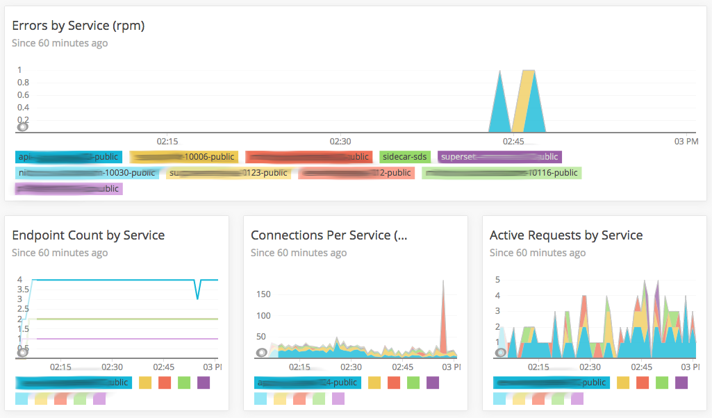

Envoymon
========

Fetches data from an Envoy `/clusters` endpoint and relays stats to New Relic
Insights via the Insights API. Keeps state between runs in memory and
calculates differences in the results so that the counters are sent up as
gauges instead.

Sample New Relic Insights dashboard using data from Envoymon:

Building
--------

On a Linux host with Docker, run `./build.sh`. A container based on Alpine
Linux is the result. It will be pushed to Docker Hub automatically, tagged
with the most recent git sha.
